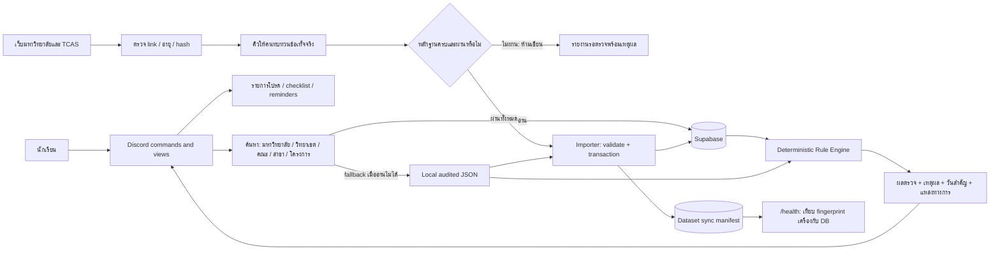
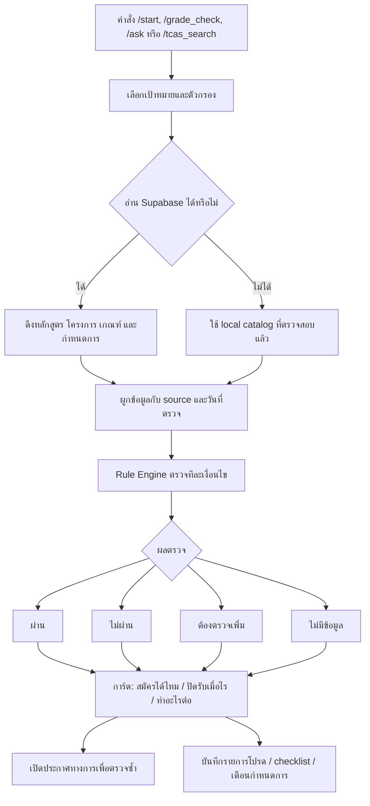
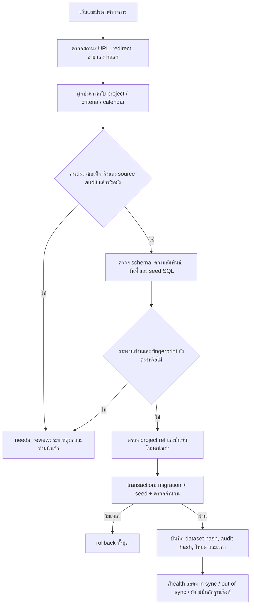

# Architecture และ Data Flow

## เป้าหมายและข้อกำหนด

ระบบช่วยนักเรียนค้นหาโครงการ TCAS Portfolio และคัดกรองเงื่อนไขจากหลักฐานที่ระบุแหล่งได้ ไม่รับรองสิทธิ์สมัครแทนมหาวิทยาลัย และไม่เติมเกณฑ์หรือกำหนดการที่ไม่มีประกาศ

หลักวิศวกรรมที่ใช้:

- **Single source of truth ต่อการปล่อยข้อมูล:** JSON + source audit ถูกตรวจเป็นชุดเดียวและผูกด้วย SHA-256
- **Fail closed สำหรับการเขียน:** ถ้าหลักฐานขาด เก่า เปลี่ยน หรืออ่านไม่ได้ จะไม่ซิงก์ข้อมูลเข้าฐานข้อมูล
- **แยก freshness ออกจากสถานะสมัคร:** “ควรตรวจซ้ำ” หมายถึงวันที่ทบทวนเกิน 7 วัน ไม่ได้แปลว่าปิดรับหรือข้อมูลผิด
- **คำนวณผลอย่างตรวจสอบย้อนกลับได้:** Rule Engine ให้ผ่าน / ไม่ผ่าน / ต้องตรวจเพิ่ม / ไม่มีข้อมูล พร้อมเหตุผลและแหล่งอ้างอิง
- **ลดการเรียกซ้ำ:** `/ask` ใช้ข้อเท็จจริงใน local catalog ก่อน; เมื่อจำเป็นจึงโหลดรายการรวมครั้งเดียวแทน query ทีละสาขา และการรีเฟรชเมนูพร้อมกันจะใช้คำขอเดียว
- **เปลี่ยนข้อมูลแบบย้อนกลับได้:** การเขียนฐานข้อมูลเป็น transaction; มีการตรวจจำนวนรายการก่อน commit และบันทึก fingerprint ใน transaction เดียวกัน
- **ทนต่อความขัดข้อง:** เมื่อ Supabase ใช้ไม่ได้ให้ใช้ local catalog ที่ผ่านการตรวจ และไม่นับ fallback ว่าเป็นข้อมูลสดจากฐานข้อมูล

## Architecture Diagram

## Data Flow: ค้นหาและคัดกรอง

## Data Flow: ตรวจและปล่อยข้อมูล

## สถานะซิงก์ที่ผู้ดูแลเห็น

| สถานะ | ความหมาย | ขั้นตอนถัดไป |
|---|---|---|
| ยังไม่มีบันทึก | ระบบยังยืนยันไม่ได้ว่าฐานข้อมูลนำเข้าจากชุดใด | ตรวจ Supabase และนำเข้าผ่าน importer |
| เติมเฉพาะที่ขาด | เพิ่มแถวที่ไม่มี แต่คงแถวเดิมไว้ จึงยังไม่รับรองว่าเนื้อหาเดิมตรงกับเครื่อง | ตรวจหลักฐาน แล้วเลือก sync แบบ reviewed เมื่อพร้อม |
| ไม่ตรงกัน | fingerprint ในเครื่องต่างจากชุดที่ซิงก์ล่าสุด | ตรวจ source audit แล้วสร้างรายงานหลักฐานใหม่ก่อน sync |
| ตรงกัน | dataset และ source audit ตรงกับชุดล่าสุดที่นำเข้าแบบ reviewed | ติดตามวันตรวจและแหล่งข้อมูลต่อไป |

## ขอบเขตและข้อจำกัด

- ตัวตรวจอัตโนมัติยืนยัน URL, freshness, hash, รูปแบบ และความสัมพันธ์ได้ แต่ไม่เข้าใจความหมายของประกาศแทนคน
- Hash เปลี่ยนเป็นสัญญาณให้ตรวจ ไม่ใช่หลักฐานว่าเกณฑ์หรือวันสมัครเปลี่ยน
- การ sync แบบ reviewed อัปเดตเฉพาะ key ที่อยู่ในชุดข้อมูลที่ผ่าน gate; ไม่ลบข้อมูลอื่นในฐานข้อมูล
- `/health` แยกสถานะ Discord, local dataset, การเชื่อมต่อ Supabase และหลักฐานความตรงกันของข้อมูล
- บอทช่วยคัดกรองเบื้องต้น ผู้สมัครต้องตรวจประกาศฉบับเต็มและยืนยันกับมหาวิทยาลัยก่อนสมัคร
