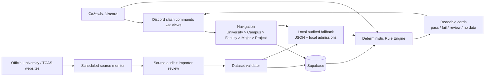
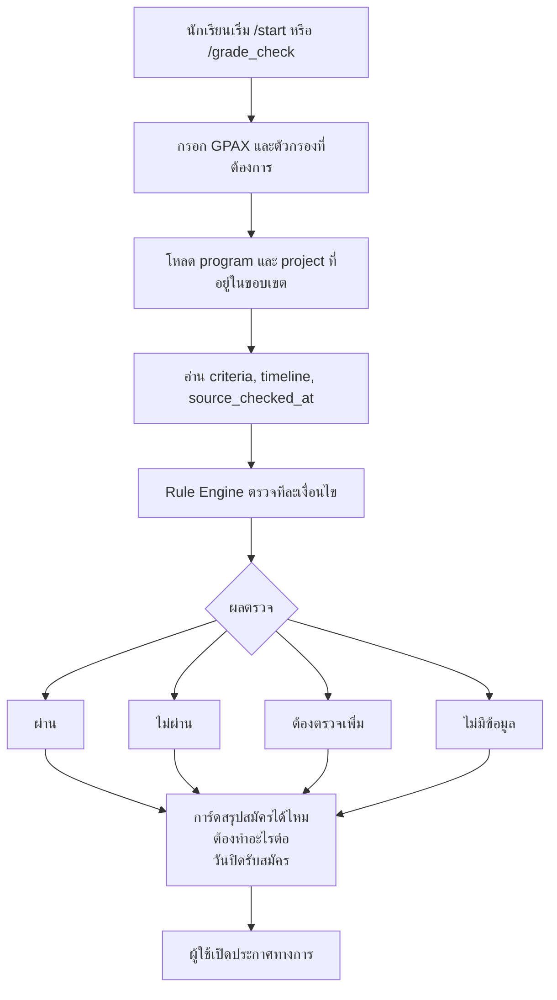

# Architecture และ Data Flow

## เป้าหมายระบบ

บอทช่วยนักเรียนค้นหาและคัดกรองโครงการ TCAS รอบ Portfolio จากข้อมูลที่ตรวจสอบแหล่งที่มาแล้ว โดยแยกให้เห็นชัดว่าอะไรยืนยันแล้ว อะไรเป็นข้อมูลอ้างอิง และอะไรยังต้องตรวจเพิ่ม

## Architecture Diagram

## Data Flow Diagram

## หลักการออกแบบ

- Rule Engine เป็น deterministic code ไม่ให้โมเดลเดาคุณสมบัติแทนประกาศ
- ทุกผลตรวจมีเหตุผลและสถานะ: ผ่าน, ไม่ผ่าน, ต้องตรวจเพิ่ม หรือไม่มีข้อมูล
- เกณฑ์ปีปัจจุบันกับข้อมูลปีก่อนแยกกันเสมอ
- คำตอบที่อาจทำให้นักเรียนเสียโอกาสต้องแสดงลิงก์ประกาศต้นทางและวันที่ตรวจข้อมูล
- ระบบตรวจเว็บตามรอบตรวจเฉพาะ link, HTTP status, อายุข้อมูล และ hash ของเนื้อหาเท่านั้น การเปลี่ยนแปลงต้องผ่านคนตรวจหรือ importer ก่อนเข้าฐานข้อมูล
- Supabase เป็นแหล่ง runtime หลัก และ local audited dataset เป็น fallback สำหรับข้อมูลที่ยังรอ seed หรือสิทธิ์อ่านเขียนมีข้อจำกัด

## ขอบเขตและข้อจำกัด

บอทช่วยลดเวลาค้นหาและชี้จุดที่ต้องตรวจ แต่ไม่ใช่ระบบรับสมัครและไม่รับรองสิทธิ์ ผู้สมัครยังต้องตรวจวุฒิ รายวิชา Portfolio เอกสาร คะแนน และวันเวลาจากประกาศทางการก่อนส่งใบสมัคร
